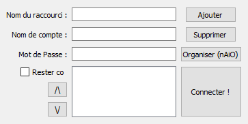

# DofLog

> DofLog est un outil de connexion automatique pour Dofus 64bits développé en Python.


- [DofLog](#doflog)
  - [Pourquoi faire](#pourquoi-faire)
  - [Installation](#installation)
  - [Développé avec](#d%c3%a9velopp%c3%a9-avec)
  - [Versioning](#versioning)
  - [Release History](#release-history)
  - [Auteur](#auteur)
  - [Licence](#licence)
  - [Contribute](#contribute)
  - [Remerciements](#remerciements)

## Pourquoi faire

Marre d'avoir des crash toutes les 5 minutes de jeu ? Vous avez un ordinateur tournant en 64 Bits ? Alors la version de Dofus en 64 Bits peut vous intéresser !

Malheureusement, connecter plusieurs compte est long et fastidieux...\
Mais pour cela il existe des outils, notamment le [nAiO](https://naio.fr/), de ZDS, qui connecte à notre place tout nos comptes. Mais il ne marche qu'en 32Bits.

C'est pourquoi j'ai développé `DofLog`, un outil pour se connecter automatiquement à Dofus en passant par l'Anakama Launcher !

\
<font size="2">*DofLog dans sa version 0.1.1*</font>

## Installation

```md
Installer la dernière version de l'Ankama Launcher.
Connectez vous avec un compte (n'importe lequel, on va régler 2~3 trucs).
Installez Dofus.
Pendant ce temps, cliquez sur la petite roue dentée (Paramètres) et
    Vérifiez que le Launcher ne se réduit pas dans la zone de notification après le lancement d'un jeu.
    A la réduction d'Ankama Launcher, il se réduise dans la barre des tâches.
Déconnectez vous.
```

> **Note :** Evitez de bouger la fenêtre de l'[Anakama Launcher](https://www.ankama.com/fr/launcher)

Téléchargez la dernière version dans l'onglet [releases](https://github.com/oxypomme/DofLog/releases).

OS X & Linux:

```sh
Non supporté
```

Windows:

```sh
Téléchargez la dernière version.
Installez.
Jouez !
```

## Développé avec

- [cx_Freeze](https://anthony-tuininga.github.io/cx_Freeze/)
- [PyAutoGui](https://pypi.org/project/PyAutoGUI/)
- [PyQt5](https://www.riverbankcomputing.com/software/pyqt/intro)
- [wget](https://pypi.org/project/wget/)
- [Win10Toast](https://pypi.org/project/win10toast/)

## Versioning

J'utilise [SemVer](http://semver.org/) pour le versioning. Pour la liste complète des versions, visitez les [tags de ce repo](https://github.com/oxypomme/DofLog/tags).

## Release History

- 0.1.1
  - Changer l'ordre de la liste directement depuis le programme
  - Indication de la position de l'Ankama Launcher lors de la première connexion (si il est introuvable par le programme)
  - Fixed : Connexion infinie
- 0.1.0
  - Ajout de comptes
  - Suppressions de comptes
  - Notifications Windows 10
  - Connexion automatique
  - Possibilité de rester connecté à l'Ankama Launcher après avoir lancé Dofus
  - Paramètre pour mettre le nom de comptes en majuscules (dans `config.ini`)

## Auteur

- [**OxyTom**](https://github.com/oxypomme) - [@OxyTom](https://twitter.com/OxyT0m8)

Lisez la liste des [contributeurs](https://github.com/oxypomme/DofLog/contributors) qui ont participé à ce projet.

## Licence

[](http://creativecommons.org/licenses/by-sa/4.0/)

This work is licensed under a [Creative Commons Attribution-ShareAlike 4.0 International License](http://creativecommons.org/licenses/by-sa/4.0/").

## Contribute

1. Fork it (<https://github.com/oxypomme/DofLog/fork>)
2. Create your feature branch (`git checkout -b feature/fooBar`)
3. Commit your changes (`git commit -am 'Add some fooBar'`)
4. Push to the branch (`git push origin feature/fooBar`)
5. Create a new Pull Request

## Remerciements

- Le [nAiO](https://naio.fr/), de ZDS, pour son concept.
- [Dofus](https://dofus.com/fr), développé par Ankama, pour continuer à nous amusez après tant d'années.
